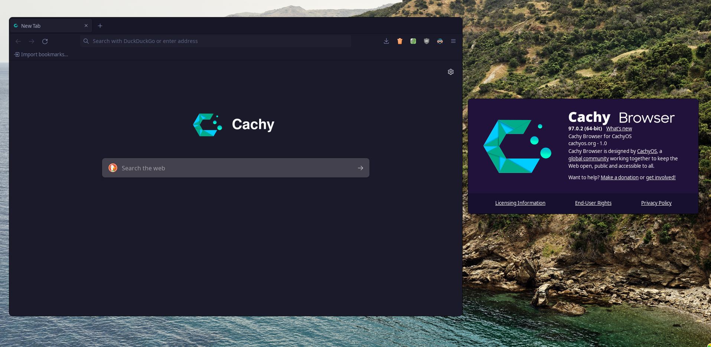

</img>

# Cachy Browser settings

##### This repository benefits from the knowledge and research provided by [arkenfox](https://github.com/arkenfox), their documentation was vital to this revamp, so special thanks to their project. We do not use arkenfox's user.js but we try to keep up with it, and we also consider it a great resource for users who want to find their own setup.

We encourage users to find **their own setup** and to use our default configuration as something to build on top of. This is now easier thanks to the overrides, just place your own preferences in the proper location:
-> `~/.cachy/cachy.overrides.cfg`

### Differences from LibreWolf:

- Enhanced security & privacy.
- Gentoo patches. Taken from Gentoo's Firefox.
- Dark Reader, ClearURLs, CanvasBlocker added.
- Moonlight theme added.
- Preset for "Profile Sync Daemon" and Firejail/Firejail(hardened) available.
- Custom Rules for CanvasBlocker & uBlock Origin.
- Custom branding.

### Notes and thanks

Some of the older prefs in this project are taken from [pyllyukko](https://github.com/pyllyukko/user.js/) and many more were investigated on [bugzilla](https://bugzilla.mozilla.org/home).

Thanks to the whole LibreWolf community.
